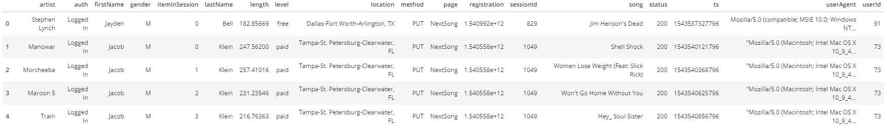

# Data Modeling with Postgres
## Introduction
A startup called Sparkify wants to analyze the data they've been collecting on songs and user activity on their new music streaming app. The analytics team is particularly interested in understanding what songs users are listening to. Currently, they don't have an easy way to query their data, which resides in a directory of JSON logs on user activity on the app, as well as a directory with JSON metadata on the songs in their app.

They'd like a data engineer to create a Postgres database with tables designed to optimize queries on song play analysis, and bring you on the project. Your role is to create a database schema and ETL pipeline for this analysis. You'll be able to test your database and ETL pipeline by running queries given to you by the analytics team from Sparkify and compare your results with their expected results.

## Project Description
In this project, you'll apply what you've learned on data modeling with Postgres and build an ETL pipeline using Python. To complete the project, you will need to define fact and dimension tables for a star schema for a particular analytic focus, and write an ETL pipeline that transfers data from files in two local directories into these tables in Postgres using Python and SQL.

## Song Dataset
The first dataset is a subset of real data from the Million Song Dataset. Each file is in JSON format and contains metadata about a song and the artist of that song. The files are partitioned by the first three letters of each song's track ID. For example, here are filepaths to two files in this dataset.

song_data/A/B/C/TRABCEI128F424C983.json
song_data/A/A/B/TRAABJL12903CDCF1A.json
And below is an example of what a single song file, TRAABJL12903CDCF1A.json, looks like.

>{"num_songs": 1, "artist_id": "ARJIE2Y1187B994AB7", "artist_latitude": null, "artist_longitude": null, "artist_location": "", "artist_name": "Line Renaud", "song_id": "SOUPIRU12A6D4FA1E1", "title": "Der Kleine Dompfaff", "duration": 152.92036, "year": 0}
## Log Dataset
The second dataset consists of log files in JSON format generated by this event simulator based on the songs in the dataset above. These simulate activity logs from a music streaming app based on specified configurations.

The log files in the dataset you'll be working with are partitioned by year and month. For example, here are filepaths to two files in this dataset.

log_data/2018/11/2018-11-12-events.json
log_data/2018/11/2018-11-13-events.json
And below is an example of what the data in a log file, 2018-11-12-events.json, looks like.

If you would like to look at the JSON data within log_data files, you will need to create a pandas dataframe to read the data. Remember to first import JSON and pandas libraries.

>df = pd.read_json(filepath, lines=True)

For example,
>df = pd.read_json('data/log_data/2018/11/2018-11-01-events.json', lines=True) would read the data file 2018-11-01-events.json.

## Project Files
You can download the project template files if you'd like to develop your project locally.

In addition to the data files, the project workspace includes six files:

1. test.ipynb displays the first few rows of each table to let you check your database.
2. create_tables.py drops and creates your tables. You run this file to reset your tables before each time you run your ETL scripts.
3. etl.ipynb reads and processes a single file from song_data and log_data and loads the data into your tables. This notebook contains detailed instructions on the ETL process for each of the tables.
4. etl.py reads and processes files from song_data and log_data and loads them into your tables. You can fill this out based on your work in the ETL notebook.
5. sql_queries.py contains all your sql queries, and is imported into the last three files above.

## ETL Pipeline

### Build ETL Processes

Follow instructions in the etl.ipynb notebook to develop ETL processes for each table. At the end of each table section, or at the end of the notebook, run test.ipynb to confirm that records were successfully inserted into each table. Remember to rerun create_tables.py to reset your tables before each time you run this notebook.

### Build ETL Pipeline

Use what you've completed in etl.ipynb to complete etl.py, where you'll process the entire datasets. Remember to run create_tables.py before running etl.py to reset your tables. Run test.ipynb to confirm your records were successfully inserted into each table.

## Sample Queries

>SELECT s.title as song name, a.name as artist name FROM artists as a JOIN songs as s WHERE s.song_id = a.artist_id
